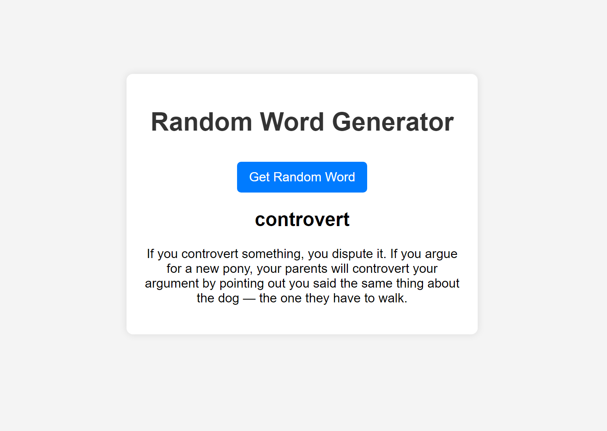

# Random Word Definition Web App

This is a simple web application that retrieves a random word from a dictionary API and displays its definition when a button is clicked.




## Project Structure

```
web-app
├── src
│   ├── index.html        # Main HTML document
│   ├── styles
│   │   └── style.css     # Styles for the web application
│   ├── scripts
│   │   └── app.js        # JavaScript functionality
├── package.json          # npm configuration file
└── README.md             # Project documentation
```

## Getting Started

To set up and run the web application, follow these steps:

1. **Clone the repository:**
   ```
   git clone <repository-url>
   cd web-app
   ```

2. **Install dependencies:**
   If there are any dependencies listed in `package.json`, run:
   ```
   npm install
   ```

3. **Open the application:**
   Open `src/index.html` in your web browser to view the application.

## Usage

Click the button on the webpage to fetch a random word and see its definition displayed.

## License

This project is licensed under the MIT License.